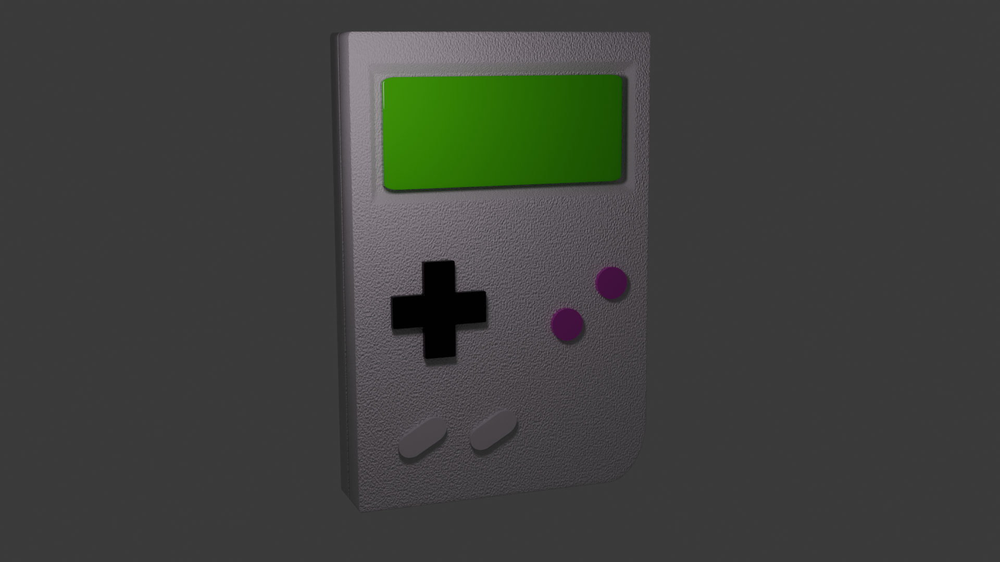

# Blender Learning Repository

This repository is used to store my Blender work and the tutorials I follow to learn 3D modeling with **Blender**.

It serves as a personal learning space where I experiment, practice, and improve my 3D skills over time.

## Projects

## 🎮 Gameboy

---

## 👾 Monster

---